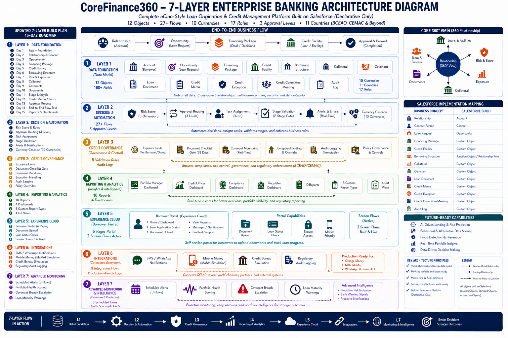

# CoreFinance360 (CF360)

> **Salesforce/nCino-inspired digital lending platform portfolio project**
> Built for BCEAO/CEMAC African banking markets — 100% declarative, no Apex code

---

## 🌍 Live Documentation

**[→ View Full Architecture Documentation](https://therence1982.github.io/CoreFinance360/CF360_Architecture_Documentation.html)**

Interactive documentation site covering all 7 layers, 12 objects, 27+ flows, approval processes, validation rules, currencies, and the Layer 3→7 breach detection chain.

---

## 📌 What is CoreFinance360?

CoreFinance360 is a complete, enterprise-grade **digital lending management platform** built entirely on Salesforce using declarative tools — no Apex code. It simulates how a modern African bank or microfinance institution manages the complete credit lifecycle:

- First borrower meeting through underwriting
- Multi-level credit approval
- Loan disbursement
- Ongoing portfolio monitoring and covenant tracking

The platform is architected on **nCino design principles** — using a central deal object (the Financing Package), stage-gated workflows, role-based access, and multi-level approval routing — but is an **original build** specifically extended to address African banking realities.

**Why it was built:**
- Many African lending institutions still rely on manual, fragmented, or paper-based processes
- Large portions of borrowers have no formal banking history or credit file
- Mobile money is the primary financial infrastructure for millions of borrowers
- Group lending structures (tontines, cooperatives) are widespread
- Multi-currency environments spanning BCEAO, CEMAC, and anglophone markets require flexible architecture

---

## 🗺️ Platform Architecture Diagram

> *Complete nCino-Style Loan Origination & Credit Management Platform —
> 12 Objects · 27+ Flows · 10 Currencies · 17 Roles ·
> 3 Approval Levels · 11 Countries (BCEAO, CEMAC & Beyond)*

---

## 🏗️ 7-Layer Platform Architecture

| Layer | Name | Key Components | Status |
|-------|------|----------------|--------|
| **L7** | Mobile & Advanced | Covenant Breach Alert · Loan Maturity Warning · Portfolio Health Score | ✅ Active |
| **L6** | Integrations | SMS Notifications · Credit Bureau Simulation · Regulatory Audit Log | ✅ Active (Simulated) |
| **L5** | Experience Cloud | Document Upload Flow · Loan Status Check Flow · Borrower Portal | ⚡ Partial |
| **L4** | Reporting & Analytics | 10 Reports · 4 Dashboards · 5 Custom Report Types · 4 List Views | ✅ Active |
| **L3** | Credit Governance | 8 Validation Rules · Exposure Controls · Covenant Monitoring · Audit Logs | ✅ Active |
| **L2** | Decision & Automation | 27+ Flows · Risk Score Formula · 3 Approval Processes · Currency Cascade | ✅ Active |
| **L1** | Data Foundation | 12 Objects · 180+ Fields · 17 Roles · 13 Permission Sets · 10 Currencies | ✅ Active |

---

## 📦 Platform at a Glance

| Component | Count | Details |
|-----------|-------|---------|
| Custom Objects | 12 | Account, Opportunity, Financing Package, Credit Facility, Borrowing Structure, Collateral, Covenant, Loan Document, Credit Memo, Credit Exception, Credit Committee Meeting, Audit Log |
| Flows | 27+ | Stage gates, task creation, currency cascade, exposure rollup, covenant monitoring, audit logs, integrations, scheduled monitoring |
| Validation Rules | 8 | KYC compliance, exposure limits, approval date enforcement, breach date tracking |
| Approval Processes | 3 | Financing Package (3-level), Credit Memo (3-level), Credit Exception (1-level) |
| Currencies | 10 | USD, XOF, XAF, NGN, GHS, LRD, KES, RWF, CDF, EUR |
| Countries | 11 | Senegal, Ivory Coast, Mali, Burkina Faso, Cameroon, Congo, Nigeria, Ghana, Kenya, Rwanda, Liberia |
| Roles | 17 | Full hierarchy from System Admin to Field Agent and Regulator View |
| Permission Sets | 13 | Granular access control per role |
| Active Users | 5 | Therence Ngoa, Kwame Asante, Fatima Diallo, Ngozi Adeyemi, Wanjiru Kamau |

---

## 🔑 Key Technical Features

### Currency Cascade — Zero Manual Selection
When a Relationship Manager selects a country in the `Primary Market` field on an Account, 5 flows work in sequence to automatically set the correct currency on every linked object:
